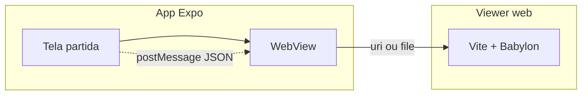

# Integração do viewer Babylon (`web/match-pitch`) no app Expo (OLEFOOT)

O campo 3D roda no **navegador** (Vite + Babylon). No **React Native / Expo**, a forma mais estável de integrar é **`react-native-webview`** carregando essa página — o motor gráfico continua no WebView; o app nativo envia estado via `postMessage` quando precisar.

---

## Visão geral



---

## 1. Dependência no Expo

Na **raiz do app Expo** (onde está o `package.json` com `expo`):

```bash
npx expo install react-native-webview
```

---

## 2. Desenvolvimento (dois processos)

1. **Terminal A — viewer Babylon** (a partir da raiz do monorepo):

   ```bash
   cd web/match-pitch && npm install && npm run dev
   ```

   Por padrão: `http://localhost:5174`.

2. **Terminal B — Expo:**

   ```bash
   npx expo start
   ```

3. **URL que o WebView deve abrir**

   - **Simulador iOS:** em geral `http://localhost:5174` funciona.
   - **Emulador Android:** use `http://10.0.2.2:5174` (loopback do host).
   - **Celular físico na mesma Wi‑Fi:** use o IP da máquina, ex. `http://192.168.1.10:5174` (não use `localhost` no aparelho).

**Android e HTTP:** em dev, pode ser preciso permitir tráfego claro. No `app.json` / `app.config.js` (só desenvolvimento):

```json
{
  "expo": {
    "android": {
      "usesCleartextTraffic": true
    }
  }
}
```

Remova ou restrinja em build de loja; em produção prefira **HTTPS**.

---

## 3. Componente WebView (exemplo)

Crie algo como `src/components/match/MatchPitchWebView.tsx` no projeto Expo:

```tsx
import { useRef } from 'react';
import { Platform, StyleSheet, View } from 'react-native';
import { WebView } from 'react-native-webview';

/** Em dev: ajuste para seu IP na rede local no celular físico. */
function pitchViewerUrl(): string {
  if (__DEV__) {
    if (Platform.OS === 'android') {
      return 'http://10.0.2.2:5174'; // emulador Android
    }
    return 'http://localhost:5174'; // iOS sim + Metro no mesmo Mac
  }
  return 'https://SEU_DOMINIO_STATICO/match-pitch/'; // produção: ver §5
}

export function MatchPitchWebView() {
  const ref = useRef<WebView>(null);

  return (
    <View style={styles.fill}>
      <WebView
        ref={ref}
        source={{ uri: pitchViewerUrl() }}
        style={styles.fill}
        allowsInlineMediaPlayback
        mediaPlaybackRequiresUserAction={false}
        onMessage={(e) => {
          // respostas do Babylon, se você injetar window.ReactNativeWebView.postMessage
          console.log('from pitch:', e.nativeEvent.data);
        }}
        javaScriptEnabled
        domStorageEnabled
      />
    </View>
  );
}

const styles = StyleSheet.create({
  fill: { flex: 1, backgroundColor: '#000' },
});
```

Use `<MatchPitchWebView />` na tela de partida ao vivo (substituindo ou sobrepondo o `PitchSvg` antigo).

---

## 4. Comunicação app ↔ Babylon (opcional, próximo passo)

1. No **viewer** (`web/match-pitch`), registre um listener:

   ```ts
   window.addEventListener('message', (ev) => {
     const data = typeof ev.data === 'string' ? JSON.parse(ev.data) : ev.data;
     // aplicar snapshot: posições bola/jogadores
   });
   ```

2. No **Expo**, injete JSON no WebView:

   ```tsx
   ref.current?.postMessage(JSON.stringify({ type: 'snapshot', payload: { ... } }));
   ```

   No iOS/Android, `postMessage` do RN para WebView pode exigir `injectedJavaScript` ou `injectJavaScript` — consulte a doc atual do `react-native-webview` para o método suportado na sua versão.

Padronize um tipo `MatchTruthSnapshot` (como nos docs do motor) para não acoplar UI nativa ao Babylon.

---

## 5. Produção

**Recomendado:** fazer `npm run build` em `web/match-pitch`, subir a pasta `dist/` para **hospedagem estática** (S3+CloudFront, Vercel, Netlify, etc.) com **HTTPS**, e no `pitchViewerUrl()` da build de loja retornar essa URL.

**Alternativa (offline):** empacotar `dist/` em `assets` e servir com `uri` `file://` — funciona, mas paths relativos de chunks do Vite exigem `base: './'` no `vite.config.ts` e teste cuidadoso no WebView.

---

## 6. Script útil na raiz (monorepo)

No `package.json` do **Expo**, você pode acrescentar:

```json
{
  "scripts": {
    "dev:pitch": "npm run dev --prefix web/match-pitch"
  }
}
```

(Confirme se `web/match-pitch` está no mesmo repositório que o Expo.)

---

## 7. Expo Web (`expo start --web`)

Se você também publica **OLEFOOT na web** com Expo, pode **iframe** ou **redirecionar** para o mesmo viewer, ou montar a rota web do Expo para importar o bundle — é um terceiro caminho; o WebView no iOS/Android continua sendo o principal para “app de loja”.

---

## Resumo

| Ambiente | O que fazer |
|----------|-------------|
| Dev | `npm run dev` em `web/match-pitch` + WebView com `localhost` / `10.0.2.2` / IP da LAN |
| Prod | Build estático + HTTPS + URL fixa no WebView |
| Estado | `postMessage` / `injectJavaScript` com snapshot JSON |

Há um arquivo pronto para copiar: [`web/match-pitch/expo/MatchPitchWebView.example.tsx`](../web/match-pitch/expo/MatchPitchWebView.example.tsx). Comandos do viewer: [`web/match-pitch/README.md`](../web/match-pitch/README.md).
