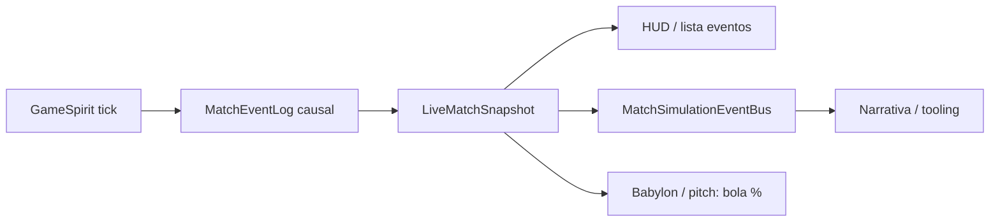

# Pipeline causal da partida (motor textual OLEFOOT)

Fluxo único: **decisão (GameSpirit) → eventos append-only → estado (snapshot) → render/bus**.



## A1 — `causalLog` no snapshot

- Campo `LiveMatchSnapshot.causalLog`: `{ nextSeq, entries }`.
- Cada entrada: `seq`, `simTime`, `type`, `payload`.
- **Placar** no minuto seguinte: `homeScore` / `awayScore` só sobem via `scoreDeltaFromEvents(entriesDoTick)` (derivado de `shot_result` com `outcome: 'goal'`).

## A2 — Cadeia mínima para golo

1. `shot_attempt` — ator, zona, minuto, alvo heurístico opcional (% campo).
2. `shot_result` — `goal` | `save` | `miss` | `block` (mesmo `shooterId` / `side` que o remate).
3. Se `goal`: `phase_change LIVE→GOAL_RESTART` → `ball_state` (centro 50,50) → `possession_change` (quem sai) → fases `KICKOFF_PENDING` → `LIVE`.

Não há golo sem `shot_attempt` imediatamente antes do `shot_result` na mesma sequência (validável com `validateGoalChain`).

## A3 — Fases do motor (`engineSimPhase`)

- Último `phase_change.to` no log completo define `LiveMatchSnapshot.engineSimPhase`.
- Distinto do `matchPhase` do pitch 3D (`MatchPlayFsm`); integração cruzada pode vir depois.

## Projeção para o bus

`emitCausalMatchEvent` mapeia entradas para `MatchSimulationEvent` (`CausalShotAttempt`, `CausalShotResult`, `Goal`, `CausalEnginePhase`, `CausalBallState`, `PossessionChanged`).

Os `MatchEventEntry` com `goal_home` / `goal_away` **não** emitem mais `Goal` no bus — só linha narrativa; o `Goal` vem do causal para uma única cronologia.

## GameSpirit (partida rápida / texto)

Em modo **quick**, o GameSpirit é a **autoridade lógica** para posse, posição da bola (%), fases de história (`spiritPhase`), overlays centrais (`spiritOverlay`) e sequência de penálti (`penalty`). O `runMatchMinute` aplica `spiritMeta` devolvido por `gameSpiritTick` e respeita `buildup_gk` / overlay antes de novo tick de lance.

O **pitch 3D** (Babylon) e o **TacticalSimLoop** em modo **live** podem usar outro FSM; não misturar snapshots entre modos — usar `LiveMatchSnapshot.mode` e manter o log causal como fonte única de placar derivado de `shot_result` (incl. `post_in` como golo).

## Próximos passos (B2–B4)

- Anti-enxame e passes longos no **match-engine** + Yuka, consumindo o mesmo snapshot e respeitando o log para `pass_attempt` / `pass_completed`.

## Teste rápido

```bash
npm run test:causal
```
